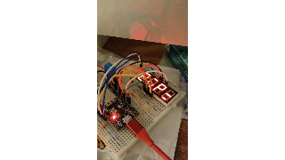

# Thermometer with ESP32 and DHT11

Can use any arduino compatible boards, it only uses digital IO pins, nothing special.

The 4 digits display rolling telop: humidity, temperature, and heat index in sequence.

