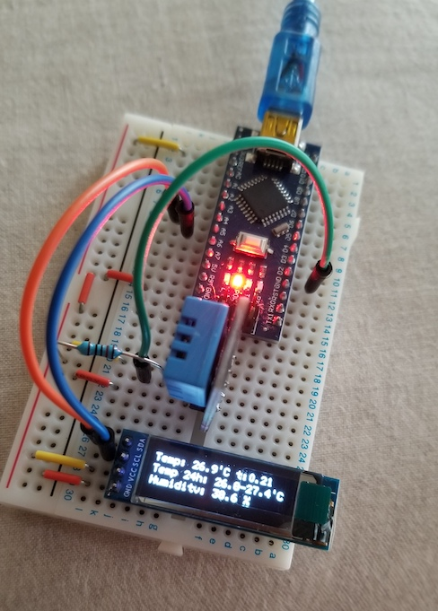

# Arduino Nano Thermometer
* Prints current temperature and humidity on OLED display, plus the 24 hours min/max temperature.
* If the program uses too much memory, the DHT11 library fails to read the sensors (had to keep it under empirical limit of 1630 bytes)
* Couldn't do min/max on humidity due to that memory constraint (OLED's library took 1K). Even for the temperature I needed to use short int (instead of float) in half hour buckets to save memory.
* Also I couldn't use more values for the running average as it would hit the memory ceiling. Try reducing this if you see memory problems in your enviroment.

## Bill of Materials
* Arduino Nano (AtMega328P)
* DHT11 (3 pins)
  * 3.3V
  * data to D2 (don't connect to analog)
* 10K resistor
  * connecting DHT11 data pin to power
* 128x32 OLED IIC I2C 0.91 inch
  * 3.3V
  * data to A4, clock to A5
